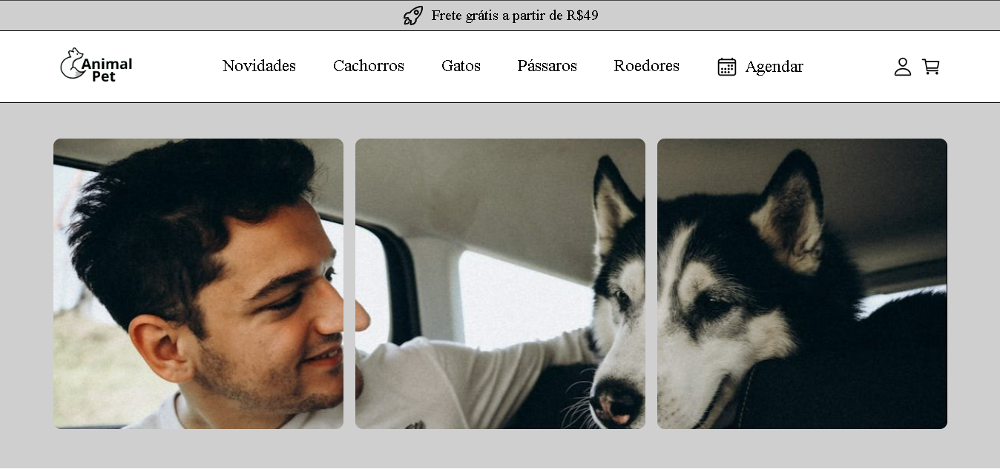

 
<h1 align="center">PetShop</h1>

## Projeto em desenvolvimento ⚙️

Esta é uma aplicação de Petshop com um robusto sistema de login e cadastro de novos usuários, integrado a um banco de dados para controle eficiente de informações. Desenvolvida como um desafio proposto por um mentor, também inclui um sistema de agendamento de serviços, permitindo ao administrador modificar o status dos agendamentos conforme necessário. 
     

    

## 🛸 Tecnologias

Esse projeto foi desenvolvido com as seguintes tecnologias:

- HTML e CSS  
- Vue.js 
- Firebase 
- JavaScript 
- Git e Github  

## Eu usei essas dependencias

Firebase - Eu utilizo o Firebase para gerenciar dados na minha aplicação, onde armazeno informações dos clientes e imagens utilizadas no sistema. 
Vue-route - Eu utilizei o Vue Router para gerenciar o roteamento da minha aplicação, configurando restrições em rotas específicas para evitar acessos não autorizados. 
Vue-Toastify - para exibir notificações temporárias na tela após ações do usuário, como mensagens de sucesso ou erro, oferecendo personalização e integração nativa com Vue.js. 

## 🖥️ Projeto 

- [Da uma olhada ai](https://petshop-six-pied.vercel.app/)

Feito com ♥ by Victor Lima
